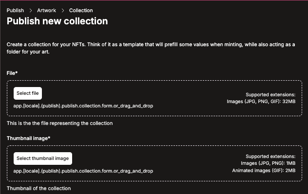
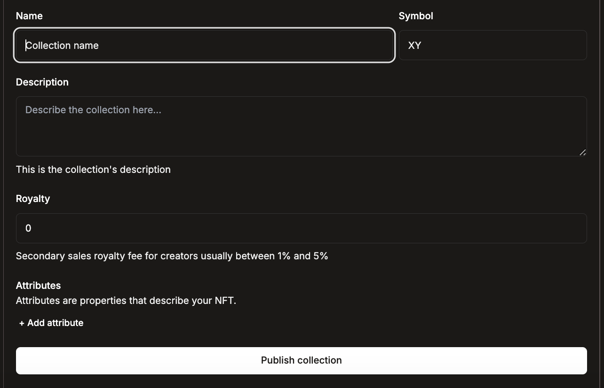
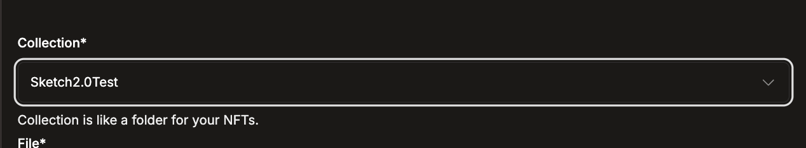
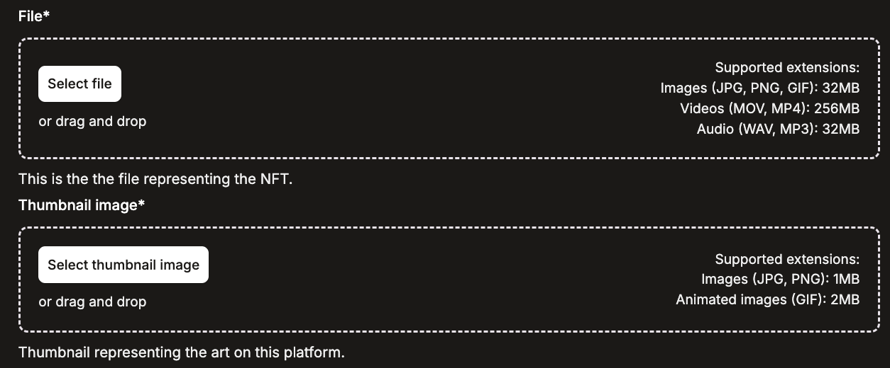
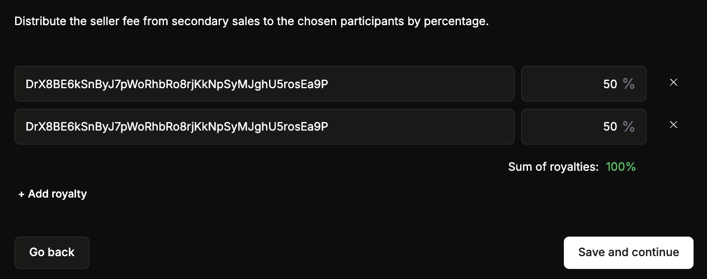
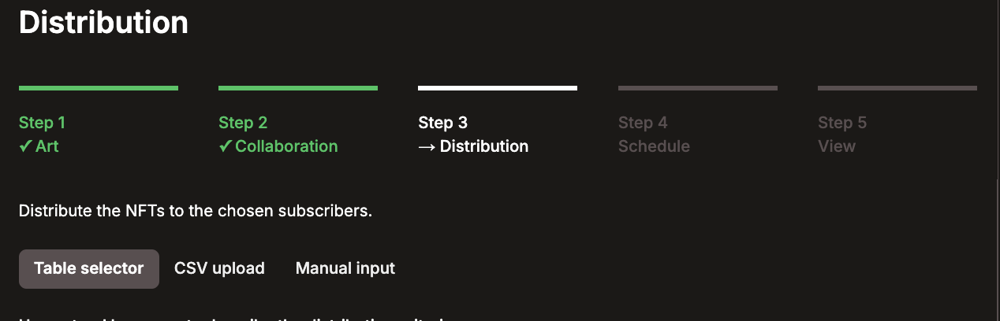
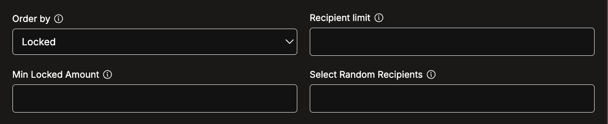
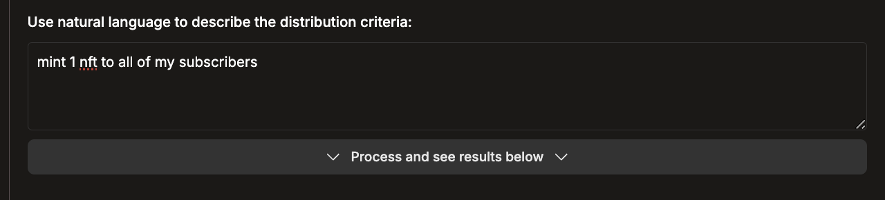

**Creating a new collection**

Before you can mint to your subscribers you need to first create a collection.

**Note:** you must have an active Access pool to mint NFTs

1. Visit [https://hub.accessprotocol.co/en/publish](https://hub.accessprotocol.co/en/publish)
2. Select the artwork tab and click Publish on hub

3. Upload a file to represent your collection – this is how your collection will appear on chain (GIF, JPG, PNG supported)
4. Select a thumbnail to represent your collection – this is how your collection will appear on the Access hub (GIF, JPG, PNG supported)

5. Select the name and symbol of your collection
6. Add a description for your collection
7. Select the base royalty for NFTs within your collection (this can be adjusted for specific mints after creating your collection)
8. Add any relevant attributes to your collection (this can be adjusted for specific mints after creating your collection)
9. Review your work and select publish collection to get minting\!

Now that you’ve published your collection you are ready to mint to your subscribers\!

**Minting NFTs to your subscribers**

1. From the drop down list, select the collection in which you wish to mint to

2. Select the file which you would like to mint to your audience \- this is how your NFT will appear on chain
3. Select the thumbnail for your mint – this is how your mint will appear on the Accces Hub

4. Select the royalty you would like to set for your collection (this is the fee you will collect on any secondary sales of your work)
5. Add any relevant URL and attributes

6. Select Save and Continue

Adding shared royalties with collaborators

On the next screen you are able to add any relevant wallets in which you wish to share royalty split.

**The sum of royalties MUST be \= to 100%**

In example below both wallets are receiving 50% of fees

Once done click save and continue to complete your mint

**Selecting your mint distribution**

****

There are 3 ways to select your distribution list

1. Table selection \- selecting recipients directly from your distribution list through the table below
2. CSV upload \- uploading a list of recipients
3. Manual wallet input \- pasting wallet addresses

**Table Selection**

There are 4 different filter settings you can use to select your distribution list:

**Order by:** the order in which your table is sorted. The parameters within this include locked, score and forever:  
 **Locked :** ordered by how much ACS have locked

    **Score:** ordered by the aggregate score of your ACS subscribers (score \= average amount of ACS locked \* duration spent in pool)

    **Forever:** ordered by amount locked in forever subscriptions

**Recipient limit:** The amount of subscribers that will receive your mint.

**Min Locked amount:** determines the minimum amount of ACS a subscriber needs to have locked in your pool to receive the drop

**Select random recipients:** selects a number of subscribers to randomly receive the mint

**Using AI to select your distribution**

You can use language to have AI determine the distribution you want. I.e. “mint 1 NFT to all of my subscribers”

****
