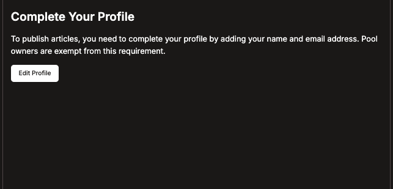
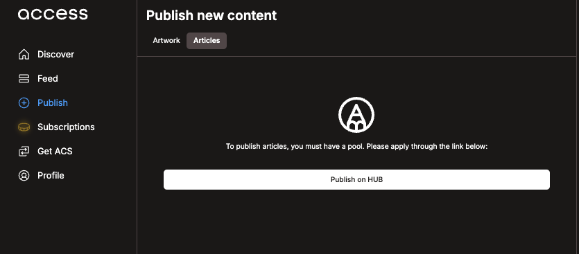
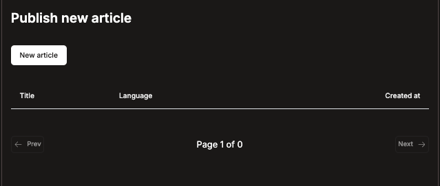
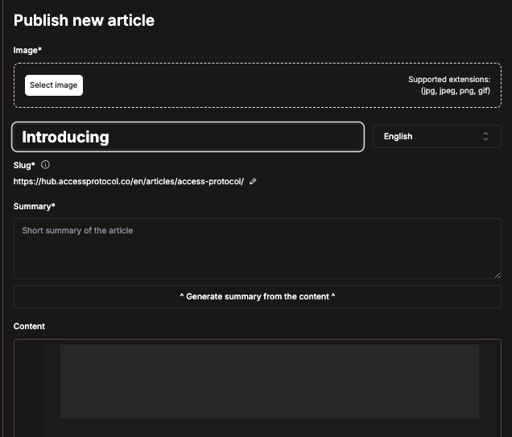
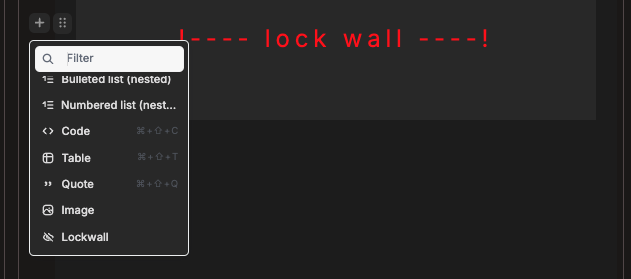
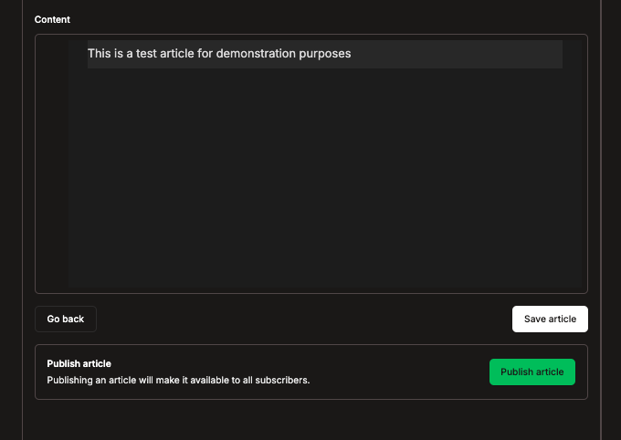
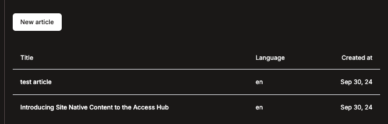

This guide will help you get started writing on the Access Hub Scribe platform.

## 1. Signing up

Publishing written content on Access is available to anyone, regardless of whether you have a pool or not.

If you already have a pool, you can skip to the "Getting Started" section.

To sign up:

1. Select the "Publish" button on the left side menu.
2. Choose "Articles".
3. Complete your profile by providing an email address, name and biography.

## 2. Getting Started

Now that you've signed up, you can begin publishing:

1. On the left side menu, select "Publish".
2. Choose the "Articles" page.
3. Click "Publish on HUB".

You can also access this page directly at https://hub.accessprotocol.co/en/publish

To create a new article, click "New article".

## 3. Key Components of an Article

- **Image**: The thumbnail for your post. Supported formats: jpg, jpeg, png, and gif.
- **Title**: The name of your article.
- **Slug**: The URL for your article. Use lowercase letters, numbers, and hyphens. This is by default auto-generated for you from the title.
- **Summary**: A brief overview of your article, often used in metadata. You can use "Generate summary from content" for an AI-written summary after completing your content.
- **Content**: The main body of your work.

Use the "+" button to add various features to your article, including the Access Lockwall.

## 4. Adding the Access Lockwall

Note: This feature requires an Access Pool.

To add the Access Lockwall:

1. Click the "+" button in the margin.
2. Scroll down and select "Lockwall".
3. The lockwall will be inserted at your cursor position.

- Content above the lockwall will be visible to all users.
- To remove the lockwall, press backspace with your cursor on the lockwall.

## 5. Saving and Publishing Articles

- To save your progress, scroll to the bottom of the article and click "Save article".
- When ready to publish, click the green "Publish article" button.

## 6. Accessing Past Articles and Drafts

1. Visit https://hub.accessprotocol.co/en/publish/articles to view your past articles and drafts.
2. Select the article you wish to edit.

