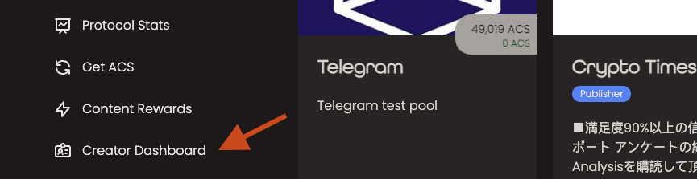
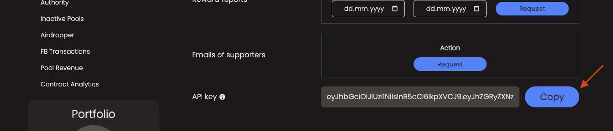

Guides how to connect to Access private (shilded by JWT token) HUB API as an creator.

## Find your JWT token

1. Visit ["HUB"](https://hub.accessprotocol.co/)
2. Login with your creator's wallet
3. Navigate to ["Creator Dashboard"](https://hub.accessprotocol.co/creator):

4. Click "Copy" button on API key field:

5. Click copy button that will copy the JWT token into your clipboard

This is JWT token that never expires so be careful where and with whom you share it. It should stay as secure as possible.

## Further reading

- Read [about how-to guides](https://diataxis.fr/how-to-guides/) in the Diátaxis framework
